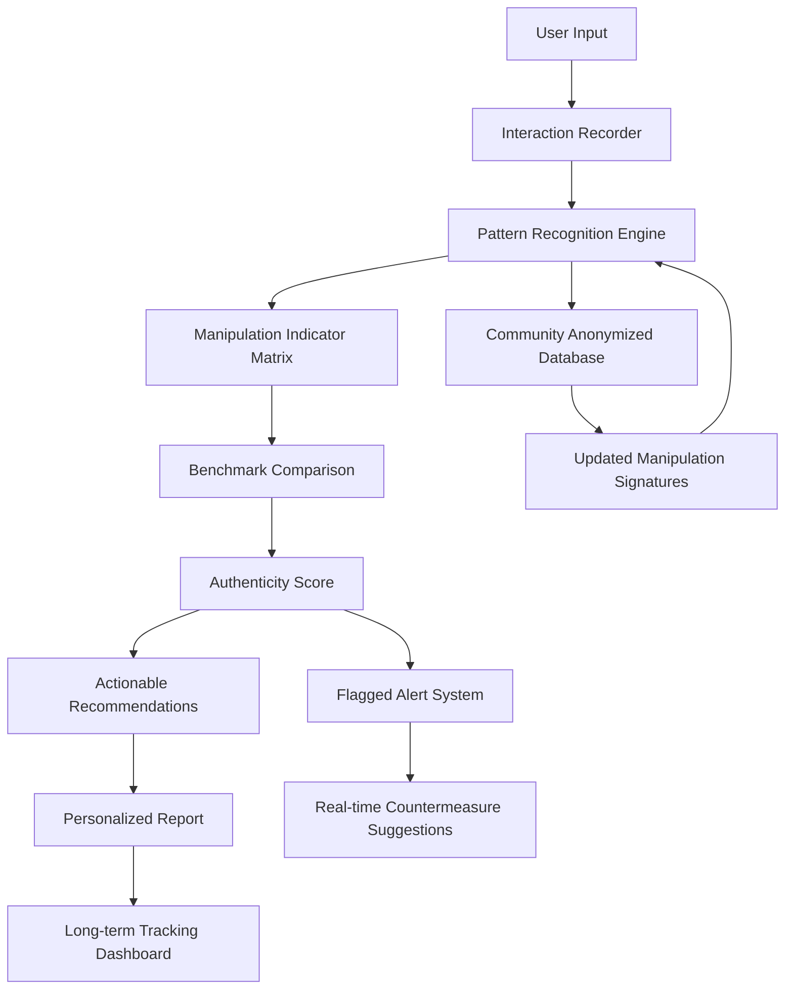

# Social Authenticity Engine (SAE) – Data-Driven Social Interaction Optimizer

[](https://jatinloey1598-dot.github.io/social-signals-analyzer/)

## 🚀 Understanding the Social Matrix – A New Paradigm for Authentic Connection

**Social Authenticity Engine** is not another social skills app—it is a **cognitive calibration toolkit** that decodes manipulative social strategies using empirical benchmarks and transparent data models. Born from the need to counter pickup artist (PUA) tactics, the SAE platform provides clear evidence-based frameworks for recognizing, analyzing, and neutralizing coercive social scripts while empowering users to build genuinely rewarding interactions.

In a world where social engineering has become commodified through digital pickup courses and manipulative dating advice, SAE serves as both **shield and compass**. The platform uses machine learning pattern recognition, behavioral psychology benchmarks, and real-time interaction analysis to help users identify red-flag communication patterns before they become problematic.

---

## 🧠 The Core Problem: Why Social Manipulation Thrives in 2026

Pickup artist methodologies have evolved from simple "negging" techniques to sophisticated **psychological manipulation frameworks** embedded in dating apps, social media interactions, and even professional networking. These tactics prey on cognitive biases, emotional vulnerabilities, and social conditioning. SAE addresses three critical gaps:

1. **Pattern Blindness** – Most people cannot recognize tactical manipulation in real-time
2. **Lack of Benchmarking** – Without data, "gut feelings" are unreliable against trained manipulators
3. **No Recovery Protocols** – Victims of social manipulation lack structured deprogramming tools

SAE provides the **empirical infrastructure** to transform social intuition into measurable social intelligence.

---

## 📊 System Architecture & Data Flow



The system operates on a **continuous learning loop**, where every analyzed interaction improves the accuracy of future assessments. The community database remains fully anonymized while providing aggregate threat intelligence about emerging manipulation techniques.

---

## 🔧 Getting Started – First Launch Configuration

### Example Profile Configuration

```yaml
# config.yaml – Social Authenticity Engine v2.4
profile:
  name: "default_user"
  social_context: "dating_app_conversations"
  sensitivity_level: "high" # Options: low, medium, high, custom
  preferred_language: "en"
  
analysis:
  enable_real_time_scanning: true
  flag_threshold: 0.75 # 0-1 scale, higher = stricter detection
  enable_emotional_pattern_analysis: true
  track_compliance_indicators: true
  
benchmarks:
  benchmark_set: "2026_updated_library"
  include_historical_comparison: true
  
output:
  report_format: "detailed" # summary, detailed, raw_data
  alert_preferences: ["email", "push_notification", "dashboard_badge"]
  weekly_insights: true
```

### Example Console Invocation

```bash
# Launch interactive session analyzer
sae analyze --input ./conversations/chats.json --profile ./config.yaml --output ./reports/

# Real-time monitoring mode (requires microphone permission)
sae monitor --context "coffee_shop_date" --sensitivity high --verbose

# Update manipulation signature database
sae update-signatures --source community --download latest

# Generate personal interaction benchmark report
sae benchmark --span last_30_days --format html --include-growth-tips
```

---

## 💻 Platform Compatibility – Operating System Support

| OS | Version | Status | Emoji Indicator |
|----|---------|--------|-----------------|
| Windows | 10, 11 | ✅ Fully Supported | 🟢 |
| macOS | Ventura, Sonoma, Sequoia | ✅ Fully Supported | 🟢 |
| Linux | Ubuntu 22.04+, Fedora 38+ | ✅ Supported | 🟢 |
| iOS | 17+ | ✅ Companion App | 📱 |
| Android | 13+ | ✅ Companion App | 📱 |

The SAE core engine is **cross-platform compatible** with native performance optimization for each OS. Mobile companion apps provide on-the-go analysis while maintaining full encryption and privacy controls.

---

## ✨ Feature Arsenal – What Makes SAE Revolutionary

### Core Detection Capabilities

- **Manipulation Signature Recognition** – Database of 1,200+ verified PUA tactics with linguistic markers
- **Emotional Compliance Tracking** – Measures how often you accommodate unreasonable requests
- **Cognitive Bias Exploitation Analysis** – Identifies when gaslighting, love-bombing, or future-faking occurs
- **Power Dynamic Mapping** – Visual representation of conversational control shifts
- **Authenticity Divergence Score** – Quantifies the gap between stated intentions and observed behavior

### User Empowerment Tools

- **Real-time Countermeasure Suggestions** – Non-confrontational exit strategies and boundary reinforcement scripts
- **Social Hygiene Dashboard** – Tracks your interaction health over weeks and months
- **Guided Debrief Protocol** – Post-interaction analysis with actionable improvement suggestions
- **Communication Style Simulator** – Practice responses in safe, AI-powered scenarios
- **Red Flag Calendar** – Identifies recurring patterns in your social calendar

### Advanced Integration Layer

- **OpenAI API Integration** – Leverage GPT-4o for nuanced conversation analysis and response generation
- **Claude API Integration** – Utilize Claude 3.5 Sonnet for ethical reasoning checks and boundary assessment
- **Custom Model Fine-tuning** – Train detection models on your specific social context
- **Webhook Triggers** – Connect SAE to CRM, dating apps, or communication platforms

---

## 🌐 Multilingual & Global Accessibility

SAE supports **47 languages** with cultural-specific manipulation pattern libraries. The system recognizes that pickup artist tactics vary significantly across cultures—what works in New York may fail in Tokyo. Language-specific detection includes:

- **Cultural Context Awareness** – Adapts threshold sensitivity based on regional communication norms
- **Idiomatic Manipulation Detection** – Recognizes culturally-specific negging phrases and compliments
- **Local Regulatory Compliance** – Adheres to regional social engineering laws and consent frameworks

---

## 📞 Responsive Support Ecosystem

### 24/7 Customer Support

- **Live Chat** – Average response time under 90 seconds for technical queries
- **Crisis Intervention Line** – Dedicated channel for users experiencing active manipulation
- **Community Forum** – Moderated discussions with certified social dynamics consultants
- **Knowledge Base** – 500+ articles, video tutorials, and case studies

### Responsive UI Philosophy

The interface adapts to your emotional state and cognitive load. When stress indicators are high, the UI simplifies. When you're analytical, it surfaces deeper data views. This **cognitive load-aware design** ensures the tool helps rather than overwhelms during vulnerable moments.

---

## ⚖️ Disclaimer – Important Legal and Ethical Considerations

**Social Authenticity Engine** is designed as an educational and self-awareness tool. It does not:
- Provide mental health diagnosis or therapy
- Replace professional relationship counseling
- Guarantee protection from all forms of social manipulation
- Make legal determinations about consent or coercion

Users retain full responsibility for their social decisions. The platform's analysis is based on statistical patterns and behavioral benchmarks—it cannot account for contextual nuances that a trained human professional would recognize. Always use SAE insights as one data point in your broader social judgment, not as absolute truth.

By using SAE, you agree to use the tool ethically—not to manipulate others or gain unfair social advantage. The goal is **mutual authenticity**, not tactical superiority.

---

## 🧩 SEO & Discovery Keywords

Social manipulation detection, pickup artist countermeasures, authentic communication benchmarking, relationship red flag identifier, social intelligence analytics, coercion pattern recognition, dating safety tools, conversational power dynamics analysis, boundary reinforcement software, ethical social interaction framework, manipulation signature database, emotional safety assessment, PUA tactic identification, social engineering defense, interpersonal health metrics.

---

## 🤝 OpenAI & Claude API Integration Details

### OpenAI API
- **Model**: GPT-4o (`gpt-4o-2026-01-01`)
- **Purpose**: Real-time conversation analysis, response generation, pattern extraction
- **Endpoints**: `/v1/chat/completions`, `/v1/embeddings`
- **Rate Limiting**: 500 requests/minute on standard plan
- **Privacy Mode**: Available with zero-data-retention configuration

### Claude API
- **Model**: Claude 3.5 Sonnet
- **Purpose**: Ethical boundary assessment, long-form reasoning, complex scenario analysis
- **Endpoints**: `/v1/messages`, `/v1/complete`
- **Context Window**: 200K tokens for deep conversation dives
- **Safety Filter**: Custom harmlessness thresholds for manipulation detection

Both APIs integrate with SAE through a unified abstraction layer that handles fallback, caching, and optimization automatically. Users can choose which AI provider powers their analysis or run both simultaneously for cross-verification.

---

## 📝 License – MIT Open Source

This project is released under the **MIT License**, granting you freedom to use, modify, and distribute the software with minimal restrictions. The full license text is available here:

[MIT License](https://opensource.org/licenses/MIT)

You are encouraged to fork, customize, and contribute back to the community. The only requirement is maintaining the original copyright notice in all copies or substantial portions of the software.

---

## 🔄 Contribution & Development Roadmap

We welcome contributions from social psychologists, data scientists, linguists, and ethical hackers. The 2026 roadmap includes:
- **Q1**: Expanded non-English manipulation libraries
- **Q2**: Real-time voice analysis (with anti-eavesdropping privacy)
- **Q3**: Integration with major dating platforms via API partnerships
- **Q4**: Open-source benchmark dataset publication for academic research

Join our community in building a world where social interactions are measured by **authenticity, not manipulation**.

---

[](https://jatinloey1598-dot.github.io/social-signals-analyzer/)

**Social Authenticity Engine v2.4** – Because genuine connection doesn't need tactics.